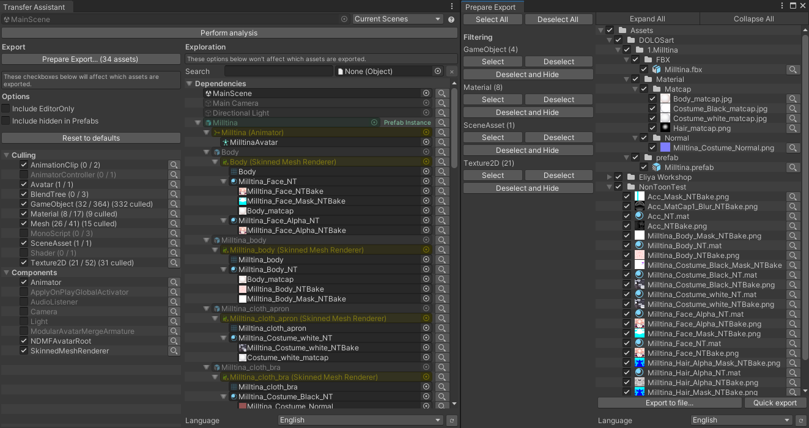
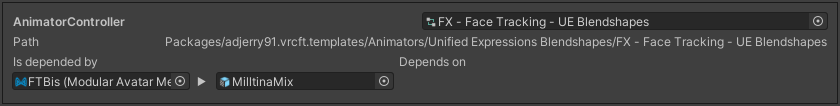
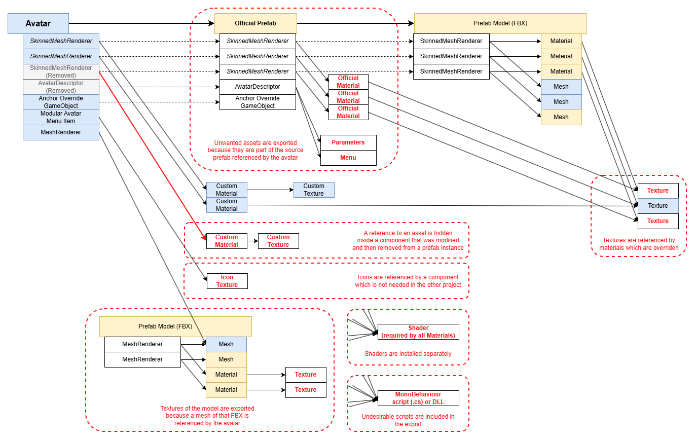

Transfer Assistant
=====

This Unity tool will assist you when you want to use the *Export .unitypackage* function to **transfer assets from one project
to another project**, while stripping assets that you deem unnecessary.

Rather than including all referenced assets, it will deliberately ignore some of them:

- Instead of exporting every asset referenced by prefabs, it only exports assets that exist on the main avatar.
  If a prefab uses an asset that the main avatar does not, it is not included (this is the default behavior, but it can be changed).
- You may choose to ignore assets by type, along with any asset referenced by those assets. Ignoring materials will also ignore textures used by those materials.
- You may choose to ignore assets referenced by specific component types. Ignoring the *Modular Avatar Menu Item* component will also ignore the icon textures referenced by those components.
- You may choose to ignore assets referenced by objects marked as EditorOnly.

If a suspicious asset is being included in the export, and you are not sure why that's the case, the *Transfer Assistant* user interface can help you locate which object or component depends on it.

*Transfer Assistant* will never modify the contents of Scenes or Prefabs.

The intended use case for this tool is to **export an avatar project file between different games**, e.g. from a Unity 2022 BIRP project to a standalone Unity 6.4 URP project.
In such a project, assets are scattered across multiple folders, and within those folders, there are assets that you want to exclude because they serve no purpose in the destination project,
such as animator controllers or animation files.

That said, this tool may still be used to transfer avatars or other asset types between projects designed for the same game.

### What this tool is NOT designed for

This tool is **not** designed for exporting .unitypackage files meant to be published and distributed as part of a release, as such assets typically need more rigorous discipline in the folder structure.
Some functionality of this tool may be used for introspection purposes, but it is **not recommended** to use this tool for the management of product releases.

## The problem this tries to solve

When exporting a custom avatar using Unity's default *Export .unitypackage* function to transfer assets between projects, assets are often scattered across multiple folders as expected
from a custom avatar. However, the contents of the export often end up with extra assets that aren't particularly needed by the custom avatar because:
- You do not want accidental references left over unintentionally inside the active hierarchy:
  - Prefab instances may contain ghost references to assets that aren't being used.
  - Components may contain stray references to sub-assets of a model or a transform within a prefab, which would in turn pull all the assets of the source prefab.
- You do not want assets referenced by incompatible components:
  - Some components may be irrelevant in another project (e.g. *Modular Avatar Menu Item*) and contain references to assets such as icon Textures.
  - Some proprietary assets may be incompatible in another project (e.g. *Expression Menu*), and those assets may themselves contain references to other assets.
  - Some Unity assets may be irrelevant in another project (e.g. *Animator Controller*, *Animation Clip*).
- You have installed some common assets separately:
  - Shaders, scripts, and DLLs are often undesirable as they are usually installed separately by the user.
- You have replaced assets or removed objects from the active hierarchy:
  - The original version of a prefab may contain undesirable references to assets (such as Materials) that your prefab instance is not using.
    - For example, an undesirable Material may be shipped with the original prefab of a purchased avatar, but you have already replaced it with your own.
    - Or, you have removed a Component or a GameObject from a prefab which contained references to other assets.
  - In some cases, you may have deliberately used the *EditorOnly* tag to signify that you aren't interested in some objects, so Materials and Textures referenced by those *EditorOnly* objects might not be required.
    While we will still export assets from objects marked as *EditorOnly* by default, you have the choice to perform more aggressive culling by excluding assets referenced by such objects as well.
    - The GameObjects and Components will continue to exist in the hierarchy as this tool does not modify scenes or prefabs; only the assets will be excluded.
    - If a prefab instance is marked as EditorOnly, we will still export the corresponding prefab source to prevent errors during import.

This tool attempts to facilitate the transfer of an avatar between incompatible game projects by offering opportunities to cull superfluous assets while keeping the avatar in an editable state in the destination project.

*Transfer Assistant* will never modify the contents of Scenes or Prefabs.

### Before

### After

## Reference manual

### Open the Transfer Assistant window

In the *Project* tab, right-click a prefab or scene and choose *Transfer Assistant...*

Alternatively, you can go to *Window > Haï~ > Transfer Assistant*, then choose a prefab, and click the *Perform analysis* button.

#### Selecting multiple targets

The dropdown on the top right lets you switch between different object selection modes.

- **Single Target**: Only one root object is analyzed.
- **Multiple Targets**: Multiple root objects are analyzed.
- **Current Scenes**: Add root objects of all opened scenes are analyzed, and the Scene itself is added for export.
  - For now, this does **not** include render settings from the scenes. Skybox, lighting data, and other scene references won't be included in the export.

If you decide to change the target, click the *Perform analysis* button before continuing.

### Transfer Assistant window

Press the checkboxes in the sidebar on the left to affect which assets will get exported.

These checkboxes have a cascading effect; unchecking Materials will affect which Textures get exported.

- **Culling** checkboxes:
  - When checking an asset type, those asset types are included, and any other asset referenced by those asset types is discovered and traversed.
  - When unchecking an asset type, those asset types are not included, and assets referenced by those asset types are not discovered.
- **Component** checkboxes:
  - When checking a component, any other asset referenced by those components is discovered and traversed.
  - When unchecking a component, assets referenced by those components are not discovered.
  - *This does not remove the Components from the prefab. Transfer Assistant never modifies prefabs nor scenes.*
- **Include EditorOnly**:
  - When checked, all objects are included. **This is the default option.**
  - When unchecked, assets referenced inside `EditorOnly` objects and any of their children are not included.
    - However, prefabs are always included, even if the prefab instance is EditorOnly.
  - *This does not remove the GameObjects or Components marked as EditorOnly from the prefab. Transfer Assistant never modifies prefabs nor scenes.*
- **Include hidden in Prefabs**:
  - This option is related to how overriding a Prefab instance hides the assets inside the source Prefab.
  - When checked, assets nested inside source Prefabs are included, even if your target object does not use it in its hierarchy because it overrides it.
    - This is the recommended option for **world-like projects**.
  - When unchecked, assets nested inside source Prefabs are not included, so that the only assets that are included are those that your target object uses.
    - This is the recommended option for **avatar-like projects**, and thus is the default option.
  
### Prepare Export window

In the sidebar, press the *Prepare Export...* button. This will open a new window which looks similar to the *Export .unitypackage* window.

In there, you can inspect which files would be exported and refine your selection.

The sidebar of that window has buttons for each asset type. These do not have a cascading effect.
- **Select**: Selects the assets of this type, which will include them in the export.
- **Deselect**: Deselects the assets of this type, which will exclude them from the export.
- **Hide**: Deselects the assets of this type and removes them from the Export window.
  - *Note: Pressing Hide will **not** deselect the assets that are referenced by those assets, so this is different from the Culling option. Read more about this in the next section below.*

Press the *Export Selected* button to export the selected assets.

#### Difference between Culling and Filtering

You will notice there are two systems that will help narrow down which assets are exported: Culling, and Filtering.

I think it's better to explain with an example.

- **Culling:** When you have Textures inside Materials, and you use **Culling** to remove all Materials from the export, then all Textures inside those Materials will be removed from the export too.
  - Culling is the method you should use when you want to **exclude an asset and everything it depends on from the export**.
  - It is the recommended method to **exclude scripts and shader files**, as scripts may contain references to icon Textures.
  - If an asset is depended on by multiple other assets, then it is only excluded when all the assets that depend on it are also excluded.
- **Filtering:** When you have Textures inside Materials, and you use **Filtering** to remove all Materials from the export, then Textures will still be included in the export.
  - Filtering is the method you should use **when you have already transferred assets to another project, and you want to perform a partial update**.
  - Consider using Filtering when there is an incompatible asset type containing references to compatible assets that you have plans to repurpose
    (e.g. *Expression Menu* that references menu icons that you will reuse in a different menu system)